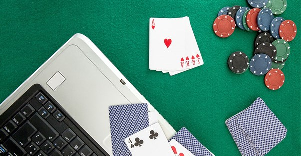

# Reinforcement Learning Project on OhHell

A project to create a reinforcement learning agent to play the card game OH Hell. There are various versions of the game but they all require a lot of skill to master. The ultimate aim of the project is to search for the best possible strategy when playing this game.

The version of the game used in this code is a simple one-off 10 card game.

This is a link to a website where you can play a Oh Hell game that plays 10 cards then 9 cards all the way down to 1 card and then back up to 10 cards.

[Oh Hell Website](https://cardgames.io/ohhell/)

# Credits
Throughout this project I used a lot of different resources and techniques to create the game environment and neural network
The structure of the game environment - [RLCARD](https://github.com/datamllab/rlcard)
The idea to train the agent against itself (NFSP) - [NFSP](https://arxiv.org/abs/1603.01121) 
A template project using PPO on the game Big2 - [Big2PPO](https://github.com/henrycharlesworth/big2_PPOalgorithm)
For an implementation of the PPO algorithm in PyTorch - [SB3](https://github.com/DLR-RM/stable-baselines3)

